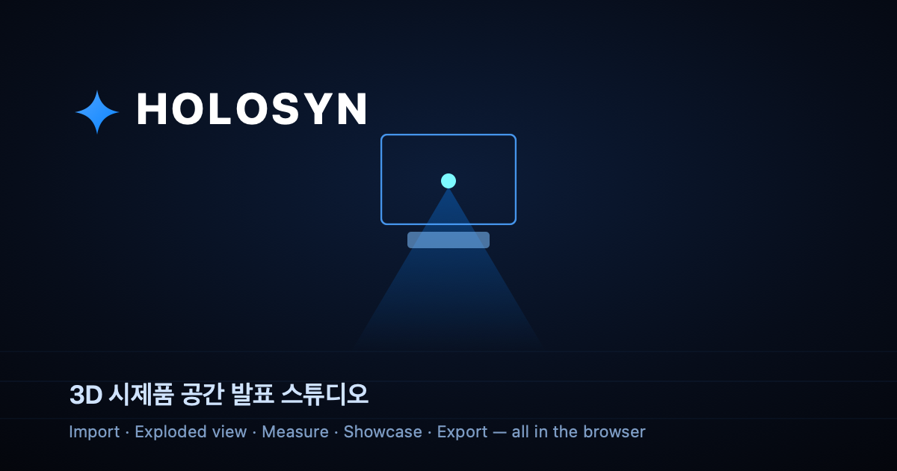

# HOLOSYN — 3D 시제품 공간 발표 스튜디오

[](https://github.com/tatao4503/holosyn-3d-studio/actions/workflows/ci.yml)
[](https://github.com/tatao4503/holosyn-3d-studio/actions/workflows/pages.yml)
[](https://github.com/tatao4503/holosyn-3d-studio/releases)
[](LICENSE)

**[Live Demo](https://tatao4503.github.io/holosyn-3d-studio/)** · [User Guide](USER_GUIDE.md) · [Demo Script](DEMO_SCRIPT.md)

> Import a 3D model or image, present it as a clean hologram, walk through its
> parts, measure it, and hand off a brief — all in the browser. No install,
> build step, or backend — a pure static site.



**HOLOSYN**은 하드웨어 시제품을 홀로그램 스타일로 띄우고, 부품을 하나씩 짚어가며
설명하고, 치수를 재고, 발표용 자료까지 내보내는 **브라우저 기반 공간 발표 스튜디오**입니다.
제작 도구(CAD)도 임베드 뷰어도 아닌, **"발표·시연 전용"** 이라는 빈 자리를 채웁니다.

### ✨ Highlights
- **Import anything** — `.glb` / `.gltf` / `.obj`, or a flat image projected as a 3D holographic relief
- **Part Scan** — step through each component with auto-generated talking points
- **Material Reveal** — switch between hologram structure, original product PBR/color, and focused-part hybrid reveal
- **3D Measure** — click two points for a real-world dimension readout
- **Exploded view · Assembly steps · Timeline director** for staged walkthroughs
- **Showcase mode** — hide all HUD, product only; Play Show for an auto cinematic pass
- **Share link** — pack model, lighting, color, camera, timeline, notes, and saved dimensions into one URL
- **Portable project** — pack the actual model, camera, timeline, notes, and dimensions into one `.holosyn` file
- **Clip recorder** — export 3-second or 5-second rotating/exploded WebM clips from the viewport
- **30s Pitch Run** — one button stages hero view, exploded structure, Part Scan, Showcase, Final Pass, and a share URL
- **Export suite** — GLB, spec JSON, HQ PNG, client brief, rehearsal runbook, demo/handoff pack, presenter notes, measurements, beta launch/ops packages
- **Pepper's Ghost** 4-way split for a physical acrylic-pyramid display
- Beginner / Pro modes · guided tours · mobile touch gestures · i18n (KO/EN)

### 🛠 Tech
Vanilla JavaScript · **Three.js** (WebGL, post-processing bloom, GLTF/OBJ loaders) ·
Web Audio API · IndexedDB · PeerJS (optional live collaboration) — no framework,
no build step, no backend.

### 📌 About
A solo project exploring how far a single person can take an idea by directing AI
coding tools (concept, direction, review, and iteration by the author; implementation
via AI pair-programming). Built as the presentation tool for a real prototype —
a social-venture ramen-shelf nameplate — and grown from a weekend experiment into a
full spatial presentation studio. See [`USER_GUIDE.md`](USER_GUIDE.md) for the full manual.

The hosted demo includes the complete local-first presentation workflow, and
runs entirely in the browser with no backend.

## Quick Start

### Recommended

Double-click:

```text
HOLOSYN 실행.command
```

The launcher starts a local server and opens HOLOSYN in your browser.

In Beginner mode, use the three controls over the viewport:

```text
1 IMPORT -> 2 REVEAL (HOLO / COLOR / PART) -> 3 PITCH & SHARE
```

Switch to Pro only when you need the timeline, measurements, diagnostics, or detailed export controls.

### Terminal

```bash
cd path/to/hologram-viewer
python3 -m http.server 4173 --bind 127.0.0.1
```

Then open:

```text
http://127.0.0.1:4173/index.html
```

## Smoke Check

Run this after editing the app:

```bash
node scripts/smoke-check.mjs
```

It checks the core files, key UI hooks, import reliability diagnostics, productization panels, final readiness controls, beta launch/ops controls, timeline module, AI/collaboration safeguards, cache tags, and JavaScript syntax.

## Cold QA

Use this after leaving the project alone for a few days:

1. Launch HOLOSYN from `HOLOSYN 실행.command`.
2. Confirm the first screen still reads as a 3D prototype presentation studio.
3. Boot the engine, pick one sample, and follow `NEXT ACTION`.
4. Open `Part Scan`, check the Part Map rail, then apply one Demo Scene Preset.
5. Save a Project Snapshot and check that Final Readiness reaches `DEMO READY` or better.
6. Run Beta Launch Pack and confirm GUIDE, IMPORT, PERF, SNAPSHOT, EXPORT, and DOCS.
7. Run Beta Ops Pack: export the test plan, benchmark, error report, example pack, deploy checklist, and release package.
8. Export the Rehearsal Runbook or one-click Demo Pack, then stop if nothing feels confusing.

## File Map

- `index.html` wires the static app shell and CDN libraries.
- `index.css` owns the full responsive HUD and hologram presentation styling.
- `app.js` owns the core 3D engine, viewport state, imports, exports, and mobile shell.
- `scripts/holosyn-timeline.js` owns Timeline Keyframe Director playback, keyframes, export/import, and remote timeline sync.
- `scripts/holosyn-pro-managers.js` owns Pro interaction layers: collaboration, AI assistant, and tutorial flow.
- `scripts/smoke-check.mjs` verifies the handoff-critical hooks after edits.

## Demo Flow

1. Click `HOLOSYN 엔진 기동`.
2. Choose a sample model or drop in your own 3D file.
3. Check the import quality card for presentation fit, reliability risk, mapped parts, and the fastest safe `NEXT ACTION`.
4. Use viewport gestures or `Part Scan` to isolate one component while the rest of the assembly stays translucent.
5. Use `MATERIAL REVEAL` to compare HOLO, PRODUCT color, and focused-part HYBRID views.
6. Click `30s PITCH` when you need the shortest judge/investor-friendly path; it now ends with a product-color reveal.
7. Apply a Demo Scene Preset such as Investor Pitch or Exploded Tech when you want a longer staged flow.
8. Save a Project Snapshot if you want to restore the same presentation setup later.
9. Use `Timeline` or `Showcase` for a cleaner audience-facing presentation pass.
10. Edit the product name or part labels if needed.
11. Save presenter notes or multiple 3D dimensions if the demo needs exact talking points.
12. Copy a Share Link or record a short WebM clip when you need to send the same angle or motion pass.
13. Use `PORTABLE PROJECT` when the custom model itself must travel with the presentation state.
14. Review Beta Preflight, Beta Launch Pack, and Beta Ops Pack, then export the Rehearsal Runbook or click `시연 패키지 생성` for the one-click Demo Pack.
15. Export PNG, JSON, GLB, Client Brief Markdown, or the Handoff Manifest separately when needed.

## Main Features

- 3D model and image import
- Sample Prototype Gallery for fast demos, including Drone, Ring, EV, Core Cell, and Forge Exo Suit concepts
- Forge Exo Suit uses a generic cyan/blue armor-lab palette with a luminous chest core and thruster accents
- Import Quality Gate for mesh count, fit status, reliability risk, mapped-part status, exploded-view readiness, and a recommended next action
- Gesture Pilot HUD for swipe momentum, wheel explode control, and touch pinch explode control
- Imported GLB/OBJ part auto-map for custom Part Scan walkthroughs
- Original GLB PBR material and texture preservation with HOLO / PRODUCT / HYBRID switching
- Clickable Part Map rail for direct component focus during demos
- Exploded view with editable part labels
- Part Scan / Component Focus mode for one-by-one component explanation
- Prototype insight card
- Smooth workflow coach: model -> structure -> present -> export
- 30s Pitch Run for the shortest judge/investor demo path
- Final Pass lock for HQ Boost, snapshot, and export-path readiness before handoff
- Demo Scene Presets for investor, exploded tech, retail, and technical review flows
- Suit Lab preset for powered exosuit concept experiments
- Project Snapshot save/restore for presentation continuity
- Portable `.holosyn` project export/import with a color-preserving GLB, SHA-256 integrity check, and 80MB model safety limit
- URL Share Link for restoring the same presentation state from one copied link
- Viewport Clip Recorder for short rotating/exploded WebM exports
- Multi-measurement 3D caliper with saved dimension list and JSON export
- Presenter Notes for scene-by-scene rehearsal copy and Markdown export
- Beta Preflight panel for WebGL, CDN, storage, model, and snapshot readiness
- Beta Launch Pack for onboarding availability, import risk, FPS floor, snapshot, export, and docs/package readiness
- Beta Ops Pack for user-test scripts, performance benchmark, error report, example project pack, deploy checklist, and release package
- Timeline Keyframe Director for staged prototype presentations
- Showcase / cinematic camera modes with automatic presentation-focused Part Scan
- HQ Boost render path with 2.5x DPR cap, bloom tuning, and 1.5x spec card PNG export
- Optional AI assistant and collaboration controls for pro-mode demos
- Safer AI key handling with session-only, local-save, and clear controls
- Collaboration readiness guard for PeerJS/P2P loading failures
- PNG, JSON, and GLB export
- Client Brief Markdown export for customer or team sharing
- Rehearsal Runbook Markdown export for 30-second/3-minute demo practice and risk checks
- One-click Demo Pack export with client brief, handoff manifest, project snapshot, readiness state, and recommended deliverables
- Handoff Manifest export with final readiness score, clickable readiness jumps, visible Part Map readiness, clickable next-step guidance, demo setup, quality state, and recommended asset list
- Mobile-friendly drawer controls

## Supported Inputs

- `.glb`
- `.gltf`
- `.obj`
- Common image files

Multi-part 3D models work best for exploded views and part labels. HOLOSYN reads imported mesh names, assigns presentation-friendly component roles, and makes those parts available in Part Scan. Single-mesh models still display well, but their parts cannot be separated automatically.

## Notes

- The app loads Three.js, Lucide icons, and Google Fonts from CDNs, so an internet connection is recommended.
- The AI assistant is optional. Use `SESSION` for temporary demo keys, `SAVE` only for your own device, and `CLEAR` before handoff.
- Collaboration requires the PeerJS CDN to load. If it is offline, HOLOSYN keeps the local presentation tools available.
- Exports are handled by the browser download system.
- Share Links embed presentation state only. Use the Portable Project controls when the model binary must be included; `.holosyn` bundles embed a normalized GLB up to 80MB.
- For a clean presentation, start with a Demo Scene Preset or `데모 런`, run Final Pass to lock HQ Boost and a fresh snapshot, then export the Rehearsal Runbook or one-click Demo Pack when Final Readiness reaches Demo Ready or better.
- Project Snapshots store presentation settings and timeline state in this browser. Custom model files are not embedded; drop the file again if a restored custom setup needs its original GLB/OBJ/image.
