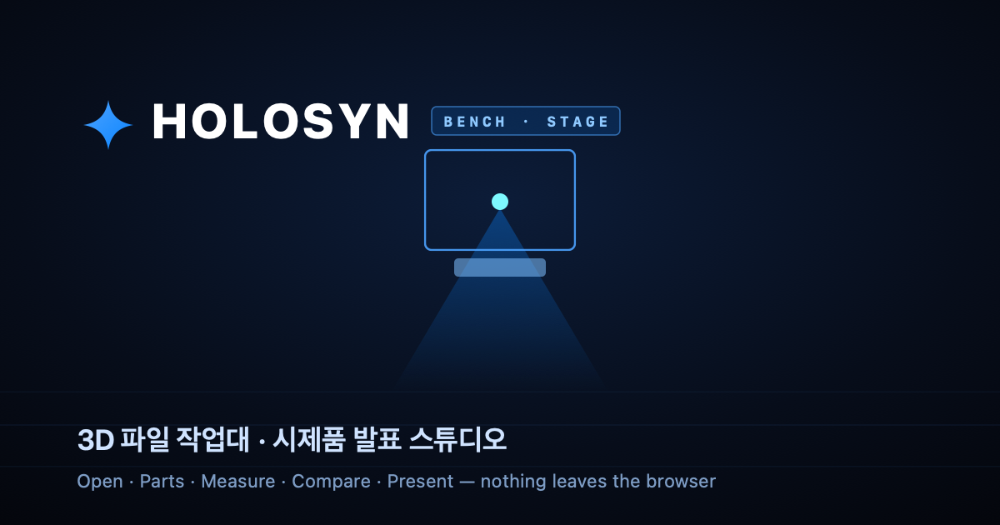

# HOLOSYN — 3D 시제품 공간 발표 스튜디오

[](https://github.com/tatao4503/holosyn-3d-studio/actions/workflows/ci.yml)
[](https://github.com/tatao4503/holosyn-3d-studio/actions/workflows/pages.yml)
[](https://github.com/tatao4503/holosyn-3d-studio/releases)
[](LICENSE)

**[Live Demo](https://tatao4503.github.io/holosyn-3d-studio/)** · [User Guide](USER_GUIDE.md) · [Demo Script](DEMO_SCRIPT.md)

> **Present the prototype you are not allowed to upload.** Your model is opened
> by the browser and never leaves it — there is no server to send it to. Walk
> through its parts, measure it, point at it, and run the whole thing at a booth
> with the wifi off.



**1인 메이커와 하드웨어 개발자를 위한 발표 도구입니다.** 아직 출원 전이거나, 공모전에
내기 전이거나, 그냥 남한테 안 보여준 시제품 — 그런 걸 클라우드에 올리지 않고
발표하려고 만들었습니다. 3D 파일을 브라우저에 떨어뜨리면 홀로그램 무대에 서고,
부품을 하나씩 짚고, 치수를 재고, 관객 폰으로 QR을 쏘고, 프로젝터에는 무대만 띄웁니다.

계정도 가입도 서버도 없습니다. 런타임까지 저장소 안에 들어 있어서 **인터넷이 없는
부스에서도 그대로 돌아갑니다.**

## 3분 안에 해보기

1. **[라이브](https://tatao4503.github.io/holosyn-3d-studio/)** 를 열고 `엔진 기동` → 샘플 하나 클릭
2. 내 `.glb` / `.obj` 파일을 화면에 드롭 — 크기는 자동으로 맞춰집니다
3. 헤더의 `무대만` — 조작 화면이 사라지고 제품만 남습니다. `Esc`로 복귀
4. `EXPORT SUITE → QR` — 관객이 폰으로 스캔하면 같은 장면이 열립니다

그 다음은 [USER_GUIDE.md](USER_GUIDE.md)의 "비기너 3단계"면 충분합니다.

## 어떤 자리에서 쓰나

| 상황 | 쓰는 것 |
|---|---|
| 공모전·데모데이 5분 발표 | `30s PITCH` 로 순서 잡고, `무대만` 으로 프로젝터에 |
| 부스에서 지나가는 사람에게 | `전시 링크` — 무인 루프, 유휴 시 조작 숨김, 오프라인 |
| 심사위원이 직접 돌려보게 | `관람 링크` 또는 QR — 읽기 전용, 편집 패널 없음 |
| 발표 며칠 뒤 다시 찾기 | 보관함 — 모델·썸네일·날짜가 이 브라우저에 남음 |
| 다른 노트북으로 옮기기 | `휴대용 프로젝트` — 모델까지 한 파일로 |

## 🔒 내 모델은 어디로 가나

**아무 데도 안 갑니다.** 백엔드도, 계정도, 업로드 엔드포인트도 없습니다 — 파일은
브라우저가 읽어서 로컬에서 그립니다. 이건 "바뀔 수 있는 정책"이 아닙니다. 보낼 데가
없습니다.

**직접 확인하세요.** 개발자도구 → Network를 열고 앱을 부팅해 샘플을 불러오면
**요청 31개, 전부 이 사이트 자기 주소**입니다. 탭 밖으로 나가는 게 없습니다.
(2026-09-19 라이브에서 재측정.)

Three.js·아이콘·QR·폰트가 CDN이 아니라 저장소 안에 있어서, 랜선을 뽑아도 똑같습니다 —
`HOLOSYN 전시.command`가 그 용도입니다.

### 밖으로 나가는 건 딱 둘

둘 다 프로 모드에만 있고, 기본으로 꺼져 있고, 관람·전시·리빌 화면에서는 쓰이지
않습니다.

| 기능 | 어디로 | 언제 |
|---|---|---|
| AI 어시스턴트 | `generativelanguage.googleapis.com` | 본인 API 키를 직접 넣었을 때만 |
| 실시간 협업 | PeerJS 공개 브로커 (연결 중개만) | 세션을 시작했을 때만 |

허용되지 않는 환경이면 켜지 않으면 됩니다. 나머지는 전부 그대로 동작합니다.
분석·텔레메트리·에러 리포팅 코드는 없습니다. 발표자 노트·치수·스냅샷·보관함은 이
브라우저의 로컬 저장소에만 있습니다.

## 무엇이 들어 있나

**무대에 세우기** — `.glb` / `.gltf` / `.obj`, 또는 평면 이미지를 홀로그램 릴리프로.
자동 크기 맞춤, 부품 자동 매핑, 원본 PBR 재질 보존, HOLO / PRODUCT / HYBRID 전환.

**설명하기** — Part Scan으로 부품 하나씩, 분해도, 조립 순서, 두 점 클릭 치수 측정,
타임라인 키프레임, 30초 피치 런.

**발표 현장** — `무대만` 프로젝터 화면, 라이브 포인터(레이저·드로잉·화살표),
30초/3분/5분 타이머, QR 공유, 발표자 노트 음성 낭독.

**관객에게 주기** — 관람 링크(읽기 전용), 오프라인 전시 루프, 시네마틱 리빌 링크,
A/B 장면 비교 링크.

**남기고 옮기기** — 보관함(모델·썸네일·날짜), 휴대용 `.holosyn` 프로젝트(SHA-256 검증),
GLB / PNG / JSON / 클라이언트 브리프 / 리허설 런북 / 데모 팩, 3·5초 클립(WebM 또는 MP4).

Pepper's Ghost 4분할 · 비기너/프로 모드 · 가이드 투어 · 모바일 터치 · 한/영.

<details>
<summary>STAGE 릴리즈 — 무대와 백스테이지를 나눈 이유</summary>

무대와 백스테이지를 나눈 릴리즈입니다. 지금까지 HOLOSYN은 만드는 사람의 화면 하나였고,
공유 링크를 받은 사람도 편집 패널이 가득한 제작 화면을 열어야 했습니다. STAGE는 그 둘을
갈라서, 관객에게는 제품만 남은 화면을 주고 발표자에게는 스튜디오를 남깁니다.

Viewer · Exhibition · Reveal은 모두 이 한 가지 결정에서 갈라져 나온 화면입니다.

### Viewer Mode

스튜디오에서 만든 공유 링크에는 `?viewer=1`이 자동으로 붙고, 받는 사람은 부팅이나
편집 패널 없이 같은 모델·카메라·조명·재질·부품 상태를 바로 봅니다.

- 전체 화면 3D 뷰와 마우스/터치 궤도 조작
- 자동 발표 재생·정지와 카메라 원위치
- 이전/다음 부품 탐색
- HOLO / COLOR / PART 재질 전환
- A/B 장면이 포함된 링크에서는 두 연출 상태 즉시 비교
- 전체화면과 동일 장면 `Open Studio`
- 공유 URL의 `#hs=` 장면 상태 유지

직접 확인하려면 `index.html?viewer=1`을 열면 됩니다. Viewer에서 `Open Studio`를 누르면
`viewer`·`exhibit`·`reveal` 관람 옵션이 제거되고 같은 장면 상태는 유지됩니다.

### Offline Exhibition Mode

`전시 링크` 또는 `HOLOSYN 전시.command`로 부팅하면 관객용 화면이 자동 반복됩니다.
Three.js, 아이콘, QR, 폰트와 후처리 모듈을 프로젝트 안에 고정했기 때문에 로컬 실행은
인터넷 연결 없이도 동작합니다.

- 단일 장면은 7단계 시네마틱을 계속 반복
- A/B 장면이 있으면 10초마다 두 상태를 자동 교대
- 4.2초 동안 입력이 없으면 상·하단 조작부와 커서를 숨김
- 마우스·터치·키보드 입력 시 조작부 복귀
- 재생 버튼으로 자동 반복 일시정지·재개
- `Open Studio`로 현재 전시 장면을 유지한 채 편집 화면 복귀

협업과 AI처럼 외부 서버가 필요한 기능은 인터넷이 있어야 하며, 전시 Viewer 흐름에는
사용되지 않습니다.

### Cinematic Reveal

`리빌 링크`는 관객이 링크를 여는 순간 18초 제품 공개 연출을 자동 시작합니다. 특정 작품의
화면을 복제하지 않고, HOLOSYN의 구조·부품·재질 기능을 하나의 고유한 오프닝으로 묶었습니다.

```text
암전 → 코어 점등 → 실루엣 → 구조 스캔 → 부품 전개 → 핵심 부품 → 제품 컬러 → 히어로샷 → HOLOSYN
```

- `?viewer=1&reveal=1` 전용 관객 화면
- 현재 공유 장면을 복원한 뒤 리빌 자동 시작
- 리빌 중 `SKIP` 또는 `Esc`, 완료 후 상단 반짝임 버튼으로 다시 보기
- 모바일 화면과 운영체제의 모션 감소 설정 대응
- 완료 뒤 일반 Viewer의 부품·재질·전체화면 조작 가능

### Live Beta Session

`?test=1`은 실제 사용자가 설명 없이 핵심 흐름을 수행하는 로컬 테스트 세션입니다.
엔진·색상·부품·분해·공유의 5가지 과제를 자동 감지하고, 완료 시간과 익명 피드백을
하나의 JSON 리포트로 저장합니다.

- `BETA OPS PACK`의 `사용자 테스트` 또는 `index.html?test=1`로 시작
- 시작할 때 재질·Part Scan·분해 상태를 중립 장면으로 정리
- 과제는 순서와 관계없이 자동 완료
- 만족도 1~5점과 가장 헷갈린 점 기록
- 완료하지 못한 세션도 부분 리포트로 저장 가능
- 모델 원본, 연락처, 전체 URL, 전체 브라우저 정보는 리포트에서 제외
- 테스트 중 만든 공유·전시·리빌 링크에는 `test=1`이 포함되지 않음

</details>

## 🛠 Tech
Vanilla JavaScript · **Three.js** r128 (WebGL, bloom post-processing, GLTF/OBJ loaders) ·
Web Audio API · IndexedDB · PeerJS (optional) — no framework, no build step, no backend.
`app.js` holds the engine; the archive, stage tools and projector view are classic-script
modules under `scripts/` sharing one global scope.

## 📌 About
A solo project exploring how far one person can take an idea by directing AI coding
tools — concept, direction, review and iteration by the author; implementation via AI
pair-programming. It began as the presentation tool for one real hardware prototype,
because there was no way to show the physical object convincingly without shipping it,
and grew from a weekend experiment into a full spatial presentation studio.
See [`USER_GUIDE.md`](USER_GUIDE.md) for the manual.

## Quick Start

### Recommended

Double-click:

```text
HOLOSYN 실행.command
```

The launcher starts a local server and opens HOLOSYN in your browser.

In Beginner mode, use the three controls over the viewport:

```text
1 IMPORT -> 2 REVEAL (HOLO / COLOR / PART) -> 3 PITCH & SHARE
```

Switch to Pro only when you need the timeline, measurements, diagnostics, or detailed export controls.

### Terminal

```bash
cd path/to/hologram-viewer
python3 -m http.server 4173 --bind 127.0.0.1
```

Then open:

```text
http://127.0.0.1:4173/index.html
```

Audience Viewer:

```text
http://127.0.0.1:4173/index.html?viewer=1
```

Offline Exhibition:

```text
http://127.0.0.1:4173/index.html?viewer=1&exhibit=1
```

또는 `HOLOSYN 전시.command`를 더블클릭합니다.

Cinematic Reveal:

```text
http://127.0.0.1:4173/index.html?viewer=1&reveal=1
```

## Lint

```bash
npx --yes eslint@9 .
```

`no-undef` only, across every browser script, with each script's top-level
declarations treated as shared globals — which is what the browser does. It
exists because a function can name a variable that is declared nowhere (a
local from some other function) and throw on first use with every other check
green. CI runs it.

## Smoke Check

Run this after editing the app:

```bash
node scripts/smoke-check.mjs
```

It checks the core files, key UI hooks, import reliability diagnostics, productization panels, final readiness controls, beta launch/ops controls, timeline module, AI/collaboration safeguards, cache tags, and JavaScript syntax.

## Cold QA

Use this after leaving the project alone for a few days:

1. Launch HOLOSYN from `HOLOSYN 실행.command`.
2. Confirm the first screen still reads as a 3D prototype presentation studio.
3. Boot the engine, pick one sample, and follow `NEXT ACTION`.
4. Open `Part Scan`, check the Part Map rail, then apply one Demo Scene Preset.
5. Save a Project Snapshot and check that Final Readiness reaches `DEMO READY` or better.
6. Run Beta Launch Pack and confirm GUIDE, IMPORT, PERF, SNAPSHOT, EXPORT, and DOCS.
7. Run Beta Ops Pack: export the test plan, benchmark, error report, example pack, deploy checklist, and release package.
8. Export the Rehearsal Runbook or one-click Demo Pack, then stop if nothing feels confusing.

## File Map

- `index.html` wires the static app shell and bundled runtime libraries.
- `index.css` owns the full responsive HUD and hologram presentation styling.
- `app.js` owns the core 3D engine, viewport state, imports, exports, and mobile shell.
- `scripts/holosyn-audio.js` owns the Web Audio synthesiser (ambient hum, clicks, sweeps, chime).
- `scripts/holosyn-voice.js` owns speech-to-intent and the assistant voice.
- `scripts/holosyn-pyramid.js` owns the Pepper's Ghost four-way render.
- `scripts/holosyn-sample-models.js` owns the five procedural sample prototypes.
- `scripts/holosyn-portable-project.js` owns `.holosyn` export/import and the GLB re-export it is built on.
- `scripts/holosyn-archive.js` owns the prototype archive: IndexedDB records with the model as GLB, stage thumbnail, and date.
- `scripts/holosyn-share-links.js` owns the URL-hash share state and the viewer / exhibition / reveal links built from it.
- `scripts/holosyn-presenter-records.js` owns presenter notes and saved dimensions: persistence, panels, Markdown/JSON export.
- `scripts/holosyn-media-exports.js` owns the viewport clip, GLB, spec JSON, and spec-card PNG.
- `scripts/holosyn-handoff-docs.js` owns the client brief, rehearsal runbook, handoff manifest, and demo pack.
- `scripts/holosyn-beta-ops.js` owns the timed beta session and the ops exports (test plan, benchmark, error report, deploy checklist, release package).
- `scripts/holosyn-stage-tools.js` owns the QR share, live pointer, pitch timer, and note narration.
- `scripts/holosyn-stage-only.js` owns the `무대만` projector view.
- `scripts/holosyn-timeline.js` owns Timeline Keyframe Director playback, keyframes, export/import, and remote timeline sync.
- `scripts/holosyn-pro-managers.js` owns Pro interaction layers: collaboration, AI assistant, and tutorial flow.
- `scripts/smoke-check.mjs` verifies the handoff-critical hooks after edits.

## Demo Flow

<details>
<summary>19-step full walkthrough</summary>

1. Click `HOLOSYN 엔진 기동`.
2. Choose a sample model or drop in your own 3D file.
3. Check the import quality card for presentation fit, reliability risk, mapped parts, and the fastest safe `NEXT ACTION`.
4. Use viewport gestures or `Part Scan` to isolate one component while the rest of the assembly stays translucent.
5. Use `MATERIAL REVEAL` to compare HOLO, PRODUCT color, and focused-part HYBRID views.
6. Click `30s PITCH` when you need the shortest judge/investor-friendly path; it now ends with a product-color reveal.
7. Use the live pointer (`Shift+P`) and 30s/3m/5m timer (`T`) while presenting or rehearsing.
8. Show the QR when the audience should open the current scene on a phone, or narrate saved presenter notes for a self-running display.
9. Apply a Demo Scene Preset such as Investor Pitch or Exploded Tech when you want a longer staged flow.
10. Save a Project Snapshot if you want to restore the same presentation setup later.
11. Use `Timeline` or `Showcase` for a cleaner audience-facing presentation pass.
12. Edit the product name or part labels if needed.
13. Save presenter notes or multiple 3D dimensions if the demo needs exact talking points.
14. Copy a Share Link or record a short clip when you need to send the same angle or motion pass.
15. Save two states in `A/B SCENE COMPARE` and copy its link when a client should compare color, structure, lighting, or exploded views.
16. Copy a `리빌 링크` when the first impression should progress from structure to full product color before handing control to the audience.
17. Use `PORTABLE PROJECT` when the custom model itself must travel with the presentation state.
18. Review Beta Preflight, Beta Launch Pack, and Beta Ops Pack, then export the Rehearsal Runbook or click `시연 패키지 생성` for the one-click Demo Pack.
19. Export PNG, JSON, GLB, Client Brief Markdown, or the Handoff Manifest separately when needed.

</details>

## Main Features

<details>
<summary>Complete list</summary>

- 3D model and image import
- Sample Prototype Gallery for fast demos, including Drone, Ring, EV, Core Cell, and Forge Exo Suit concepts
- Forge Exo Suit uses a generic cyan/blue armor-lab palette with a luminous chest core and thruster accents
- Import Quality Gate for mesh count, fit status, reliability risk, mapped-part status, exploded-view readiness, and a recommended next action
- Gesture Pilot HUD for swipe momentum, wheel explode control, and touch pinch explode control
- Imported GLB/OBJ part auto-map for custom Part Scan walkthroughs
- Original GLB PBR material and texture preservation with HOLO / PRODUCT / HYBRID switching
- Clickable Part Map rail for direct component focus during demos
- Exploded view with editable part labels
- Part Scan / Component Focus mode for one-by-one component explanation
- Prototype insight card
- Smooth workflow coach: model -> structure -> present -> export
- 30s Pitch Run for the shortest judge/investor demo path
- Final Pass lock for HQ Boost, snapshot, and export-path readiness before handoff
- Demo Scene Presets for investor, exploded tech, retail, and technical review flows
- Suit Lab preset for powered exosuit concept experiments
- Project Snapshot save/restore for presentation continuity
- Portable `.holosyn` project export/import with a color-preserving GLB, SHA-256 integrity check, and 80MB model safety limit
- URL Share Link for restoring the same presentation state from one copied link
- A/B Scene Compare link with studio capture, preview, and audience-side A/B switching
- Cinematic Reveal link with a one-shot structure-to-material product opening
- Viewport Clip Recorder for short rotating/exploded clips (WebM, or MP4 where the browser has no WebM)
- QR Share for opening the current presentation scene from an audience phone
- Live viewport pointer with laser, fading freehand, and arrow modes
- Pitch timer with 30-second, 3-minute, and 5-minute pacing targets
- Browser TTS narration for saved presenter notes
- Multi-measurement 3D caliper with saved dimension list and JSON export
- Presenter Notes for scene-by-scene rehearsal copy and Markdown export
- Beta Preflight panel for WebGL, CDN, storage, model, and snapshot readiness
- Beta Launch Pack for onboarding availability, import risk, FPS floor, snapshot, export, and docs/package readiness
- Beta Ops Pack for user-test scripts, performance benchmark, error report, example project pack, deploy checklist, and release package
- Timeline Keyframe Director for staged prototype presentations
- `무대만` projector view (chrome hidden, camera untouched, Esc to return) and Showcase cinematic camera pass
- HQ Boost render path with 2.5x DPR cap, bloom tuning, and 1.5x spec card PNG export
- Optional AI assistant and collaboration controls for pro-mode demos
- Safer AI key handling with session-only, local-save, and clear controls
- Collaboration readiness guard for PeerJS/P2P loading failures
- PNG, JSON, and GLB export
- Client Brief Markdown export for customer or team sharing
- Rehearsal Runbook Markdown export for 30-second/3-minute demo practice and risk checks
- One-click Demo Pack export with client brief, handoff manifest, project snapshot, readiness state, and recommended deliverables
- Handoff Manifest export with final readiness score, clickable readiness jumps, visible Part Map readiness, clickable next-step guidance, demo setup, quality state, and recommended asset list
- Mobile-friendly drawer controls

</details>

## Supported Inputs

- `.glb`
- `.gltf`
- `.obj`
- Common image files

Multi-part 3D models work best for exploded views and part labels. HOLOSYN reads imported mesh names, assigns presentation-friendly component roles, and makes those parts available in Part Scan. Single-mesh models still display well, but their parts cannot be separated automatically.

## Notes

- Core rendering, icons, QR generation, fonts, and post-processing are bundled under `vendor/` for offline local execution.
- The AI assistant is optional. Use `SESSION` for temporary demo keys, `SAVE` only for your own device, and `CLEAR` before handoff.
- Real-time collaboration and AI requests still require internet access even though their interface modules load locally.
- Exports are handled by the browser download system.
- Share Links embed presentation state only. Use the Portable Project controls when the model binary must be included; `.holosyn` bundles embed a normalized GLB up to 80MB.
- Offline Exhibition links restore built-in models and URL state. For a custom model, prepare the booth computer with a Portable Project before going offline.
- For a clean presentation, start with a Demo Scene Preset or `데모 런`, run Final Pass to lock HQ Boost and a fresh snapshot, then export the Rehearsal Runbook or one-click Demo Pack when Final Readiness reaches Demo Ready or better.
- Project Snapshots store presentation settings and timeline state in this browser. Custom model files are not embedded; drop the file again if a restored custom setup needs its original GLB/OBJ/image.
- The Archive (Pro mode drawer) does embed the imported model, as a binary GLB, along with a stage thumbnail and the save date. It lives in this browser's IndexedDB only — use `PORTABLE PROJECT` to get it out as a file.
- Presenter notes and saved dimensions persist in this browser across reloads. If the browser refuses storage (private mode, full quota) the app says so instead of claiming a save.
